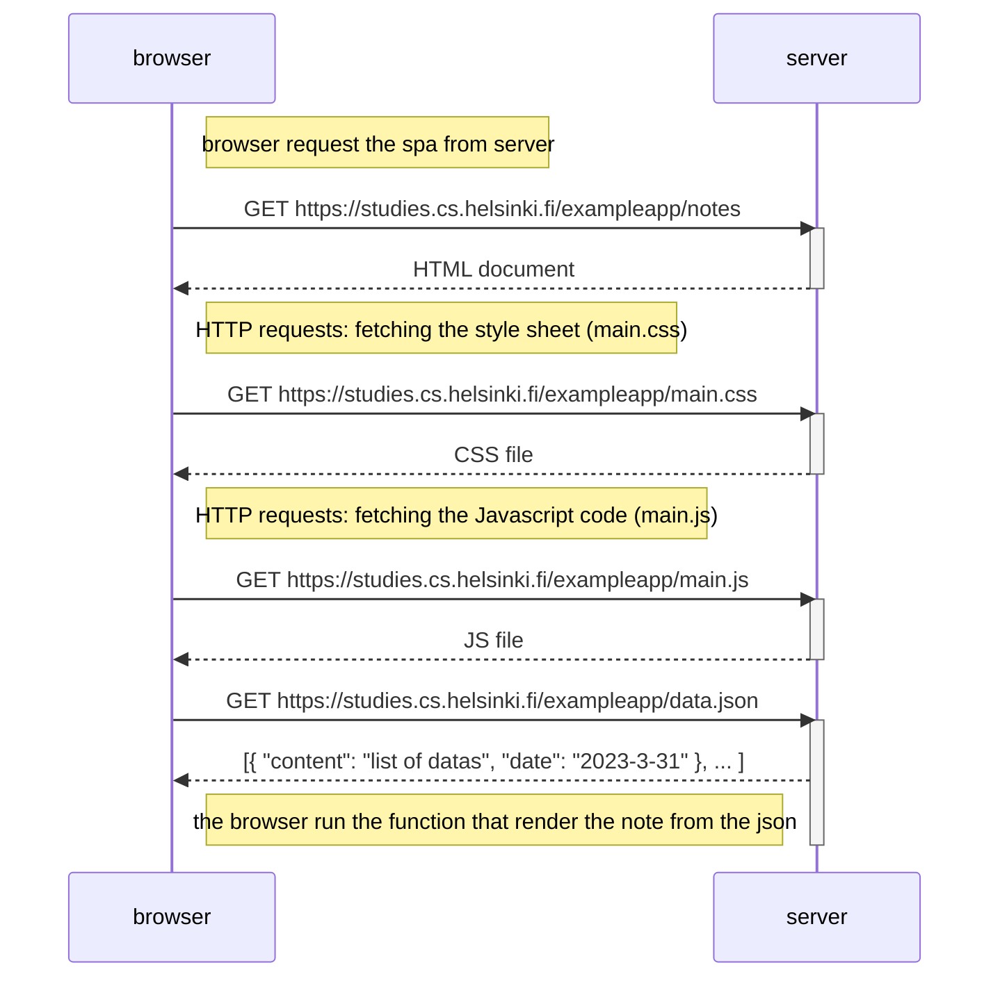

```mermaid
sequenceDiagram
    participant browser
    participant server

    Note right of browser: browser request the spa from server
    browser->>server: GET https://studies.cs.helsinki.fi/exampleapp/notes
    activate server
    server-->>browser: HTML document
    deactivate server
    Note right of browser: HTTP requests: fetching the style sheet (main.css)
    browser->>server: GET https://studies.cs.helsinki.fi/exampleapp/main.css
    activate server
    server-->>browser: CSS file
    deactivate server
    Note right of browser: HTTP requests: fetching the Javascript code (main.js)
    browser->>server: GET https://studies.cs.helsinki.fi/exampleapp/main.js
    activate server
    server-->>browser: JS file
    deactivate server
    browser->>server: GET https://studies.cs.helsinki.fi/exampleapp/data.json
    activate server
    server-->>browser: [{ "content": "list of datas", "date": "2023-3-31" }, ... ]
    Note right of browser: the browser run the function that render the note from the json
    deactivate server
```